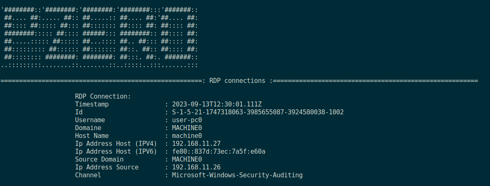
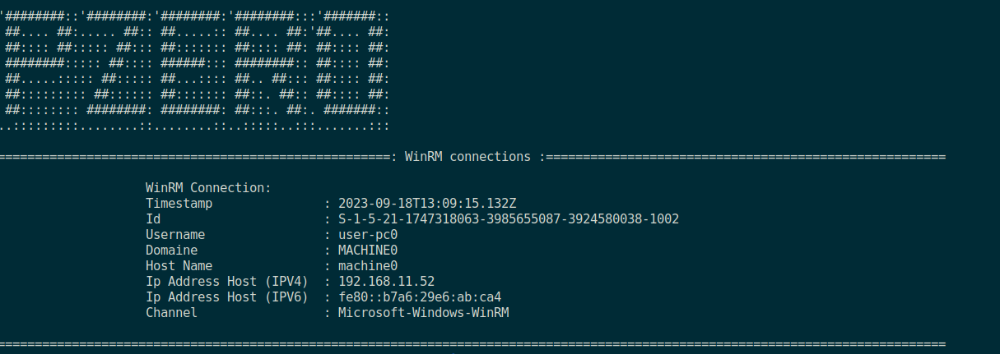
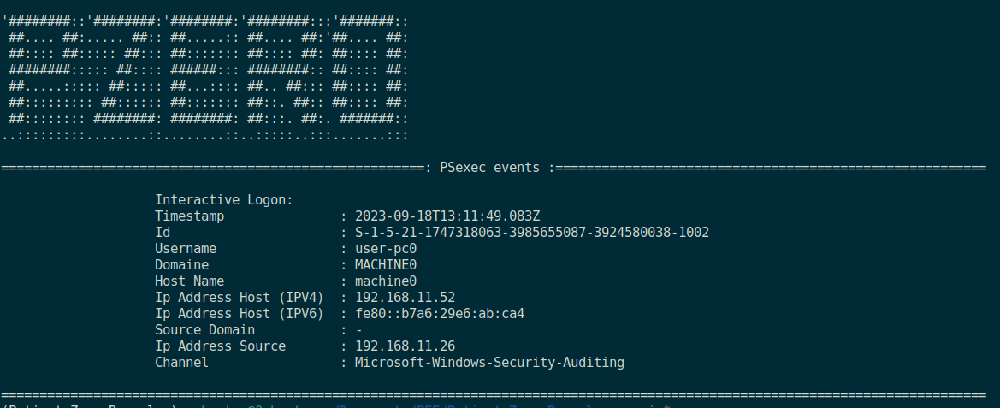
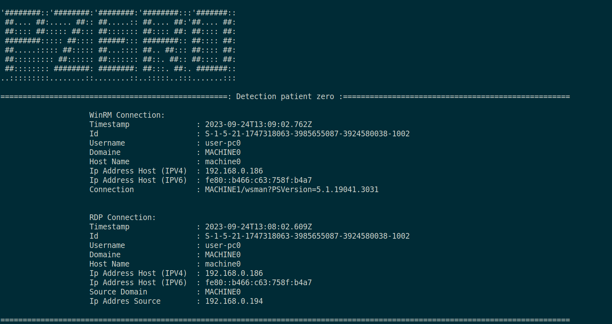

# Patient Zero Revealer

Patient Zero Revealer is a Python3 library designed to aid in digital forensics by identifying the patient zero (first infected machine) during a cybersecurity incident response. It achieves this by leveraging Windows Event Logs collected in an ELK (Elasticsearch, Logstash, Kibana) setup using [Elasticsearch](https://github.com/elastic/elasticsearch) 

## Installation
1. ### Clone the Repository:
	```bash
		git clone https://github.com/0xhunter213/Patient-Zero-Revealer.git
		cd Patient-Zero-Revealer
		pip install -r requirements.txt
	```
	### or
2. ### Setup.py
	```bash		
		cd Patient-Zero-Revealer
		python3 setup.py install	
	```

## Features
- **Windows Event Logs Analysis:** Utilizes Windows Event Logs from ELK to trace the initial access point.
- **Patient Zero Identification:** Detects the first infected machine used in the cyber attack during the investigation, collected from Windows event logs of machines in the network.
- **Elastic cloud or ELK server Integerity:** Enhances investigation by efficiently analyzing Windows event logs through seamless integration with ELK and Elastic Cloud. 
## Usage
Use `.env` file to store Elk credentials. We use Elastic Cloud for testing; a self-hosted Elk server usecase will be provided soon

```bash
# .env file content
ELASTIC_PASSWORD = <elastic user password>
CLOUD_ID = <Cloud ID>
```

```bash
$ python3 pzero.py -h

'########::'########:'########:'########:::'#######::
 ##.... ##:..... ##:: ##.....:: ##.... ##:'##.... ##:
 ##:::: ##::::: ##::: ##::::::: ##:::: ##: ##:::: ##:
 ########::::: ##:::: ######::: ########:: ##:::: ##:
 ##.....::::: ##::::: ##...:::: ##.. ##::: ##:::: ##:
 ##::::::::: ##:::::: ##::::::: ##::. ##:: ##:::: ##:
 ##:::::::: ########: ########: ##:::. ##:. #######::
..:::::::::........::........::..:::::..:::.......:::

usage: pzero.py [-h] -u USER [-i IP_SOURCE] [-t TIMESTAMP] [-o] [-r] [-s] [-w] [-I] [-Ip] [-Is] [-Iw]

Patient Zero Revealer a tool to detect first infected machine in the netwrok using Windows Event logs using one of those informations is required (USER or IP_SOURCE)

options:
  -h, --help            show this help message and exit
  -u USER, --user USER  Username of a suspicious user in the network
  -i IP_SOURCE, --ip-source IP_SOURCE
                        Ip address from Network of a machine to follow its events
  -t TIMESTAMP, --timestamp TIMESTAMP
                        Start time for analysing events
  -o, --output          Output of Detection results in given filename
  -r, --rdp             Analyzing only RDP connections
  -s, --ssh             Analyzing only ssh connections
  -w, --winrm           Analyzing only WinRM connections
  -I, --impackt         Analyzing Impacket tools use cases from events (psexec,smbexec,wmiexec,...)
  -Ip, --psexec         Detect of Impacket psexec tools from event
  -Is, --smbexec        Detect of Impacket smbexec tools from event
  -Iw, --wmiexec        Detect of Impacket wmiexec tools from event
```

Different parameters can be used, such as the username the attacker used or the IP address of the last machine detected with suspicious behaviors.

if can be used on other script for detection different Network connection or using of Impacket tools
```python

from elasticsearch import Elasticsearch
# all modules of Patient Zero Revealer tool
from Impacket_detection import *
from Elk import *
from Network_protocols_detection import *
from Revealer import pzero_revealer

# this example use elastic cloud for analyzing windows event logs
es = 
Elasticsearch(cloud_id=apikey,basic_auth(creds.username,creds.password))

# RDP connections

events= rdp_detection.RDP_detection(es=es,user=user,ip_source=ip_source,timestamp=timestamp,all=True)
print_events(events=events)

# wirm connections 

events = winrm_detection.WinRM_detection(es=es,user=user,ip_source=ip_source,timestamp=timestamp,all=True)
events = remove_dubplication(events=events)
print_events(events=events)

# ssh conntection 

events= ssh_detection.SSH_detection(es=es,user=user,ip_source=ip_source,timestamp=timestamp,all=True)
events = remove_dubplication(events=events)
print_events(events=events)

# Impacket psexec and smbexec detection

events = pssmbexec_detection.PSSMBexec_detection(es=es,user=user,ip_source=ip_source,timestamp=timestamp,all=True)
events = remove_dubplication(events=events)
print_events(events=events)

#Impacket wmiexec detection 

events= wmiexec_detection.WMI_detection(es=es,user=user,ip_source=ip_source,timestamp=timestamp,all=True)
events = remove_dubplication(events=events)
print_events(events=events)

# Use event searching for personalized searches
search_query = {
        "bool":{
            "must":[
                {"match":{"event.code":"4688"}}
            ],
			}
		}
event = event_searching(es=es,query=search_query)
print(event)
```
### example:
#### RDP detection 

#### winrm detection 


#### psexec detection 


#### detection patient zero

The tool compiles a list of steps taken in the attack. It starts from a machine showing suspicious behavior and the username responsible for it. Then, it traces back to find the initial infected machine. This is determined using the information from the last event in the list.


## Contributing

Pull requests are welcome. For major changes, please open an issue first
to discuss what you would like to change.

## License

[MIT](https://choosealicense.com/licenses/mit/)
